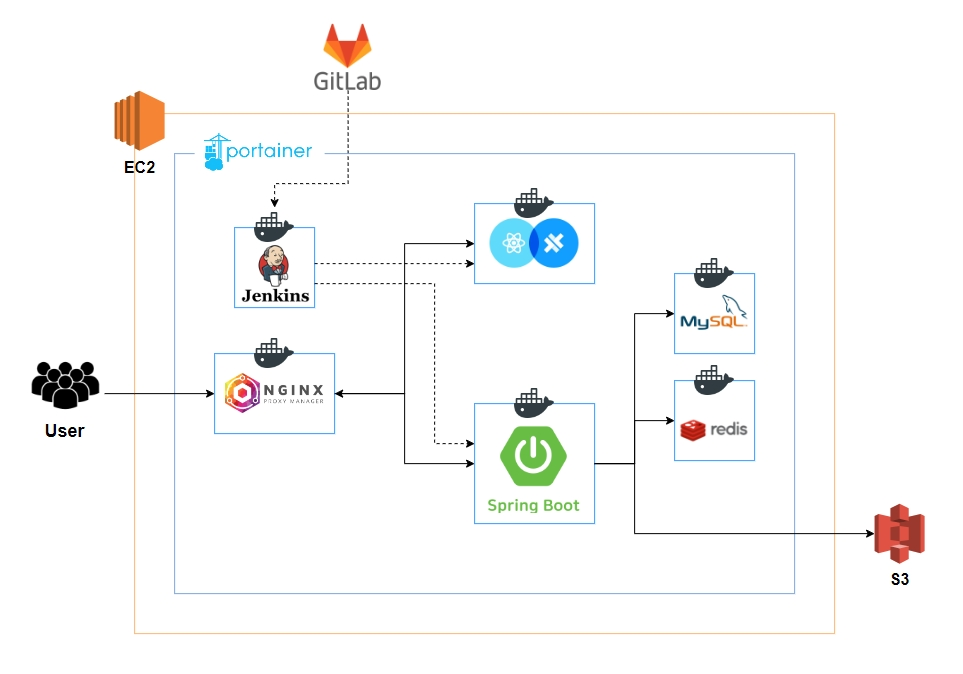

  

---

## 📚 TOC

- [BACKEND & DATA TEAMS](#backend-data-teams)
- [ROLE](#role)
- [DEPLOY URL](#deploy-url)
- [SPECIFICATION](#specification)
- [INTRODUCTION](#introduction)
- [SKILLS](#skills)
- [SYSTEM ARCHITECTURE](#system-architecture)
- [SERVICE LAYOUT](#service-layout)
- [FUNCTION](#function)

 

---

## 🤝 Backend

|  |  |  |
|:--------------------------------------------------------------------------------------------------------:|:-----------------------------------------------------------------------------------------------------:|:--------------------------------------------------------------------------------------------------:|
|                                  [김건우](https://github.com/takealook97)                                   |                                  [박재선](https://github.com/Jaeseon95)                                  |                                  [이경배](https://github.com/rglley)                                  |

---

## 🙋‍♂️ Role

### 김건우

- 팀장, 백엔드 리더
- 서버 CI/CD 구축 및 인프라 총괄
- 프로젝트 환경 구축
- 회원 기능 API 구축
- 역사 조회 기능 (문화재 + 사적지)

### 박재선

- 데이터 크롤링
- 데이터 전처리
- 역사 조회 기능 (문화재 + 사적지)
- H3 기반 거리 산정 기능
- 발표

### 이경배

- 데이터 선정
- 데이터 크롤링
- 데이터 전처리
- Firebase 알림 기능
- 역사 조회 기능 (문화재 + 사적지)
- 도감 기능

---

## 🕊️ Deploy URL

- ✅ front-server : https://seoul-pop.com
- ✅ back-server : https://api.seoul-pop.com
- ✅ back-swagger : https://api.seoul-pop.com/swagger-ui/index.html

 

## 📝 Specification

- notion : [노션 주소]

 

---

## 📢 Introduction

### main-service

- **SEOUL-POP (서울팝)**
- 위치 기반 역사 탐방 서비스
- 백그라운드 알림 기능을 통해 해당 지역의 역사 정보를 확인할 수 있다.
    - 문화재 정보, 3.1운동 사적지, 6.25 전쟁 사적지 등
- 해당 역사에 대한 상세 정보를 다양한 이미지와 함께 조회할 수 있다.
- 카메라 AR 기능과 함께 인터렉티브한 사용자 참여형 서비스를 제공한다.
- 방문을 완료하면 도감 스탬프를 획득한다.

 

---

## 🛠️ Skills

### language

- Java 17

### framework

- SpringBoot 3.2.5
- Spring Data JPA
- Spring Security
- QueryDSL

### sub

- JWT
- Oauth 2.0
- H3
- Firebase Cloud Messaging

### database

- MySQL 8.0
- Redis 7.2
- AWS S3

### ci / cd

- AWS EC2
- Jenkins
- Docker, Docker Hub, Portainer
- Nginx Proxy Manager

 

---

## 🌐 System Architecture

 

---

## 🏠 Service Layout

|  |  |
|:----------------------------------------------------------:|:--------------------------------------------------------:|
|                        History Map                         |                            AR                            |

|  |  |
|:------------------------------------------------------------------:|:--------------------------------------------------------------:|
|                          History Details                           |                             Atlas                              |

 

---

## ⚙️ Function

### 🎯 회원

💡 회원은 Spring Security & JWT & Oauth2.0 사용하여 카카오 소셜 로그인 구현

- [x] 회원 가입
- [x] 로그인, 로그아웃
- [x] 회원 탈퇴

### 🎯 역사 지도

💡 문화재 정보, 3.1운동 사적지, 6.25 전쟁 사적지 3개의 카테고리로 역사 정보 분류

- [x] 지도를 통한 위치 정보 조회 (필터 별 조회)
- [x] 주변 지역의 문화재 및 사적지 위치 추천

### 🎯 역사 정보

💡 역사 상세 정보 조회 기능

- [x] 해당 역사에 대한 상세 정보 조회
- [x] 해당 역사 관련 상세 이미지 조회

### 🎯 알람

💡 백그라운드 실시간 위치 데이터를 기반으로 한 Firebase Cloud Messaging 기능 활용

- [x] 실시간 위치 기반 주변 문화재 및 사적지 추천

### 🎯 도감

💡 방문 지역의 도감 스탬프 체크

- [x] 방문 완료 시 해당 문화재 및 사적지 도감 스탬프 획득 기능
